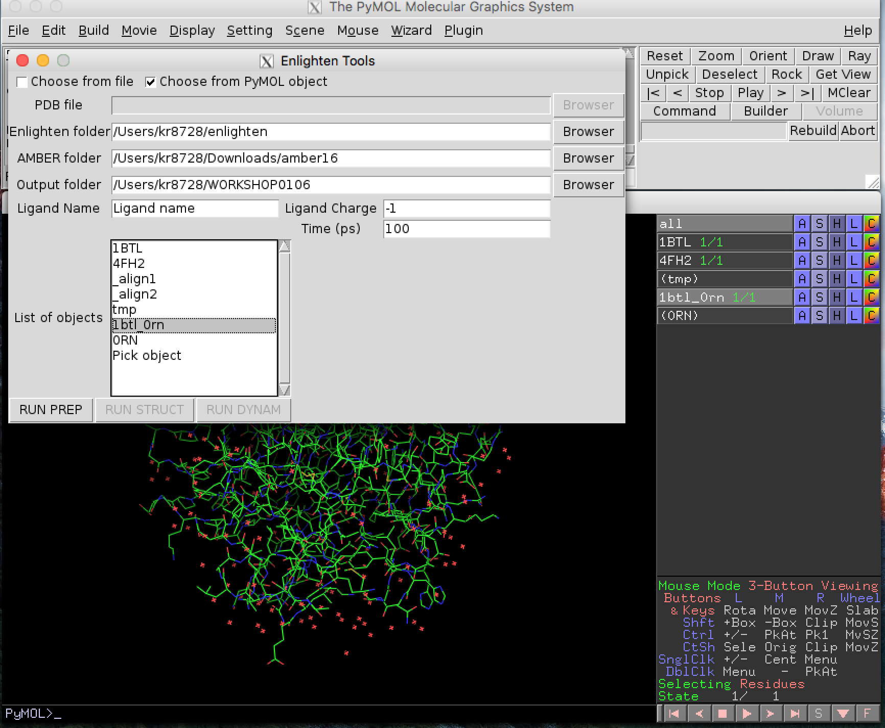

# Enlighten Workshop
As an example, we will make a model of the class A beta-lactamase TEM-1 with sulbalactam. There is no crystal structure available for this case so we will use PyMOL to create a model from two different crystal structures.

We will first obtain the Enlighten plugin from the github repository. Open a terminal and type:
 
`git clone https://github.com/marcvanderkamp/enlighten.git`

Once the files have downloaded we need to set the ENLIGHTEN variable to indicate the location of the repository. 

`export ENLIGHTEN=/my/path/to/enlighten/`

where /my/path/to/enlighten/ will be something like "/Users/kr8728/enlighten"

Start PyMOL:

`pymol`

Two windows will appear: a viewing window and a control panel. 

We now need to load the enlighten plugin into pymol. From the Plugin drop-down menu choose Plugin and then Plugin Manager.

In the Plugin manager choose the Install New Plugin tab and then select install from local file. When you click on the "Choose file" button you will need to navigate to the enlighten directory and then choose the Pymol sub-folder. Click on the \_init_.py file and choose Open to install the plugin.

A new window will pop-up asking you to select a plugin directory. Choose the first option and click OK.

A message will appear to say that the plugin has been successfull installed. Exit the Plugin manager.

We will use PyMOL to obtain the crystal structures we need directly from the protein databank. In the control panel type:

`fetch 1BTL`

A crystal structure will appear in the viewing window. You will also see an object called 1BTL appear in the right-hand viewing panel. There are buttons A,S,H etc. which contain drop down menus that allow you to make changes to how the object is viewed. 

`fetch 4FH2`

A second structure will appear, partly overlapping the first. We now need to align the structures so that we can use the coordinates of sulbalactam from 4FH2.

`align 4FH2 and name CA, 1BTL and name CA`

You will see that structure 4FH2 move so that it is aligned with 1BTL based on the positions of the alpha carbons.

We will now create a new PyMOL object which has the protein coordinates from PDB 1BTL and the coordinates of sulbalactam from PDB 4FH2. The residue name for sulbalactam is 0RN.

`select tmp, 1BTL (or 4FH2 and resname 0RN)`

`create 1btl_0rn, tmp`

We now have a new object in the right-hand panel of the viewing window called 1btl_0rn. Hide the original structures 1BTL and 4FH2 by clicking on their names in the right-hand panel.
We need to tidy up the structure a little bit before we can begin simulations. Firstly, we need to remove an SO4 ion that is present from the crystalisation conditions. Information about the crystalisation conditions and other small molecules that have been identified in the structure is given in the header of the PDB and also on the structure page of the Protein databank: <http://www.rcsb.org/pdb/explore/explore.do?structureId=1BTL>

`remove (1btl_0rn and resname SO4)`

We also need to remove the water molecules that were part of 1BTL in the region we have just placed sulbalactam. To do this we need to identlfy the water molecules overlapping with 0RN in our new model 1btl_0rn.  Now we will zoom in on the ligand.

`select 0RN, (1btl_0rn and resname 0RN)`

The new object 0RN will appear in the right-hand panel. Click on the S button and choose sticks from the drop down menu. 

This will show the ligand in stick form. From the menu that appears when you click the A button for this object choose zoom. 

We will now identify the water molecules.

`select HOH, (1btl_0rn and resname HOH within 2.0 of 0RN)`

This command will select 4 water molecules, you may wish to zoom on the HOH object to see them better. You can also change how the water molecules are displayed e.g. choose spheres from the drop-down menu that appears when you click on the S button for the HOH object. 

 
Click on the water molecules to find their residue numbers. This information will appear in the control window e.g. 

Selector: selection "sele" defined with 1 atoms.  
You clicked /1btl_0rn/C/A/HOH`404/O

When the residue numbers of all 4 water molecules have been identified they can be deleted from the structure:

`remove (1btl_0rn and resname HOH and res 323+391+404+437)`

or go to the A button for the HOH object and choose remove atoms.

 

We will now add hydrogen atoms to sulbalactam using the h_add function in PyMOL. 

`h_add (1btl_0rn and resname 0RN)`

Note that sulbalactam has a charge of -1*e* and you will need to check visually to make sure that they have been placed reasonably.
 
For ease of identification during simulations we will change the chain id for the ligand 0RN.

`alter 0RN, chain="L"`

We have everything need to create a model of the wild-type TEM-1 with sulbalactam. 
Go to the Plugin drop-down menu and choose "enlighten".
We are now ready to use Enlighten to perform some simulations. 
From the plugin menu choose enlighten:

A new enlighten control panel will appear. Some settings will be given as a default, but they can be changed if necessary. Click on the choose from PyMol object box and select 1btl_0rn, our wild-type model. You will need to change Ligand name to 0RN. Check that the other output settings are suitable and then click RUN PREP.

RUN PREP may take a couple of minutes to complete. When it is finished a new object "1btl_0rn.sp20" will be loaded into PyMOL. You will see that hydrogens have been added to the system and a solvent cap of radius 20 Å has been added to the model.

We now need to let the model system 'relax' to remove any bad contacts present in the crystal structure. Click RUN STRUCT to perform the next stage of simulation.

The STRUCT protocol will take a few minutes to run and when it has finished a new structure will be loaded into the "1btl_0rn.sp20" object and the RUN DYNAM button will become active. Click RUN DYNAM to start the dynamics simulation.

This will take some time to run, so we will now start to prepare our mutant model.

We will now create a mutant structure for to simulate for comparison. We will make the R244T mutation, which causes a 300-fold increase in *Ki* for sulbactam. See <http:www.jbc.org/content/267/29/20600.full.pdf> for the experimental details.

We will start by copying our object 1btl\_0rn to the new object 1btl\_0rn_r244t.

`create 1btl_0rn_r244t, 1btl_0rn`

We want to mutate Arg244 to Thr, so we will zoom in on this residue.

`select r244, (1btl_0rn_r244t and resi 244)`

From the Wizard drop-down menu, select mutagenesis:

Click on Arg244 and then  In the right hand panel choose Thr from the mutate to menu in the right-hand panel. 

The lowest energy rotamer will then be displayed. 

Click apply to accept the mutation and then done to exit the wizard.

From the plugin menu choose enlighten:

A new enlighten control panel will appear. To run simulations on the mutant model you will need to select the new 1btl\_0rn_r244t object from the list and then click RUN PREP. Follow the same procedure to RUN STRUCT and DYNAM for the mutant model. 

We can use some of the analysis tools available as part of AmberTools to get some more meaningful information from the simulations. We will now calculate the root-mean square fluctuations (RMSF) of the protein, a measure of the 'flexibiltiy' of the protein, and also perform a binding energy calculation using the MM-GBSA method. 

Open a new terminal and move into the dynam subdirectory of the main output directory for the wild type model.

`cd Users/kr8728/WORKSHOP0106/1btl_0rn/dynam`

Copy the analysis script to the dynam directory:

`cp $ENLIGHTEN/analysis/run_analysis.sh .`

The analyis script need to be passed the pdb name for the system and the ligand name. To perform the analysis type:

`bash run_analysis.sh 1btl_0rn.pdb 0RN`

These calculations may take a few minutes to run. The results of the MM-GBSA will appear on screen when the calculations finish e.g. "Average binding energy (MM-GBSA): -36.7273 +/- 6.0960 kcal/mol (standard error of mean 3.0480 kcal/mol)". This information is also contained in the file "FINAL\_RESULTS\_MMPBSA.dat". 

The RMSF calculation will produce a file called rmsf\_all_1btl\_0rn.pdb with the RMSF data included in the b-factor column of the pdb. Open this pdb file in PyMOL. Display as cartoon and then choose colour by b-factor to view the RMSF analysis.

Highlight the position of the sulbalactam by showing it in stick representation. The dark blue regions are the protein that was fixed during the simulations, the more flexible regions are green and orange with a small part that is coloured red.

You can also plot the RMSF data against residue number. To do this open the file "rmsf_ca.dat" with LibreOffice or EXCEL.

When the MD simulation of the R244T model has finished change into the dynam directory for that simulation and copy the run_analysis.sh script to this directory.

`cd ../../1btl_0rn_r244t/dynam`

`cp $ENLIGHTEN/analysis/run_analysis.sh .`

Run the analysis of this simulation by typing:

`bash run_analysis.sh 1btl_0rn_r244t.pdb 0RN`

Does the mutation alter the predicted binding energy? Is it more or less favourable than the wild-type? Does the mutation alter the flexibility (RMSF) of the residues?

If you have time:

- Run the MD simulations for the wild-type or mutant models again (in a different directory). Do you get the same values for the binding energy?
- Look at the residues close to the sulbalactam and choose a different residue to mutate. Does the mutation alter the predicted binding energy?

