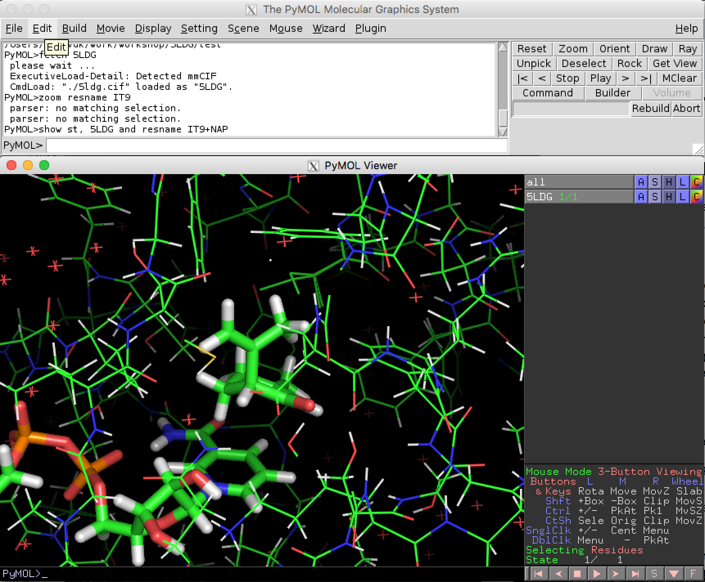
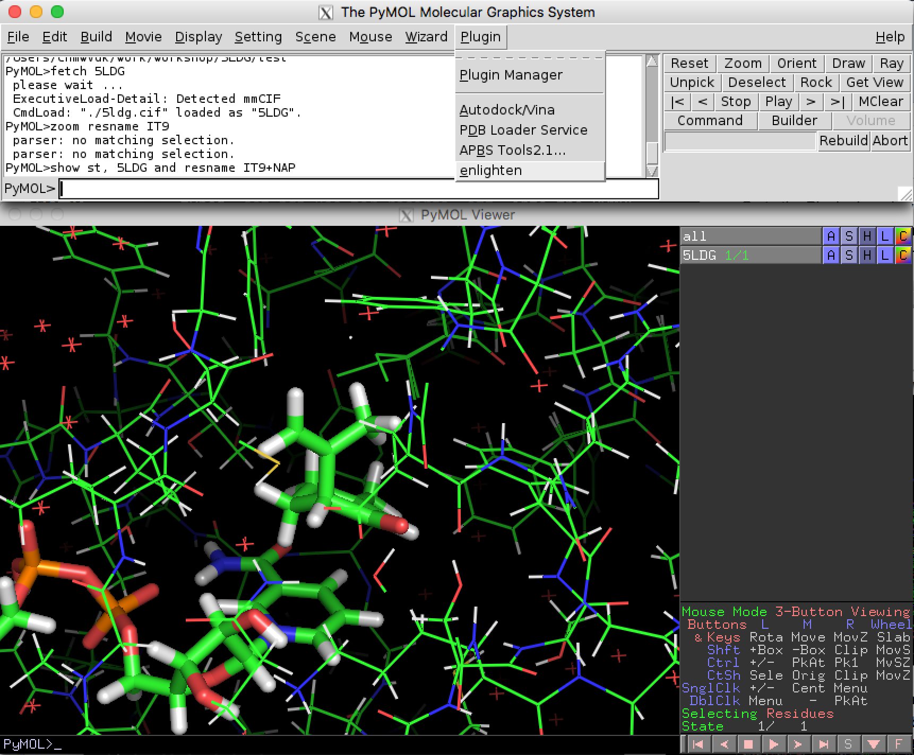
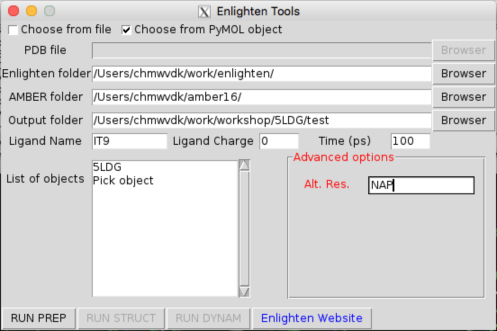
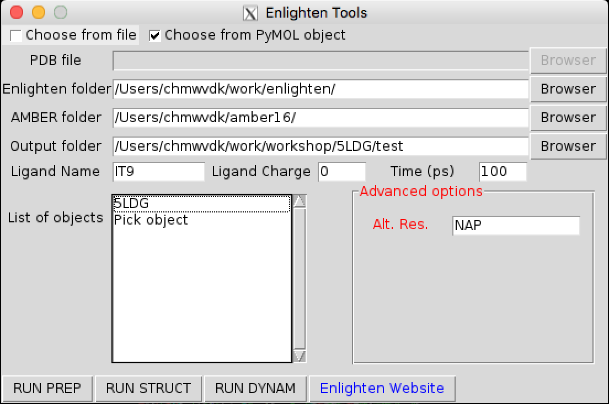
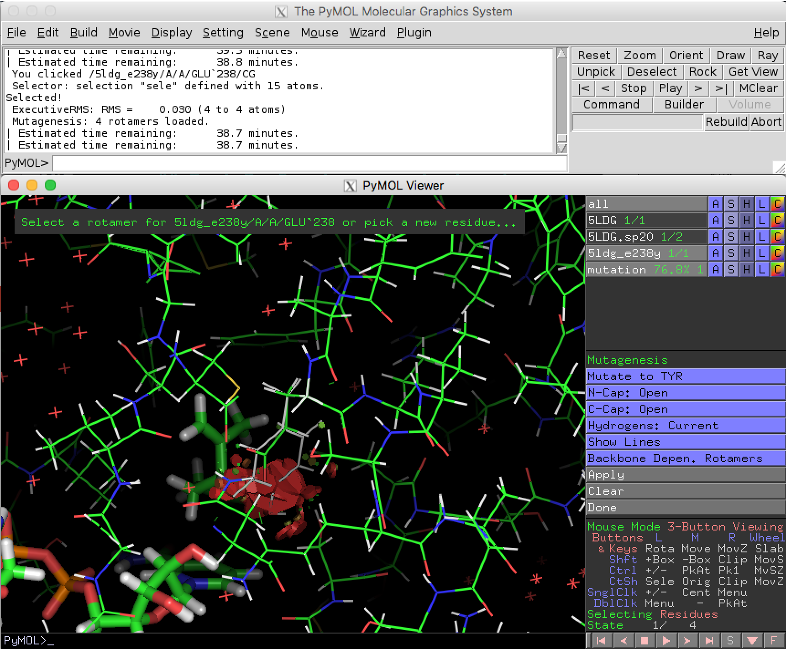
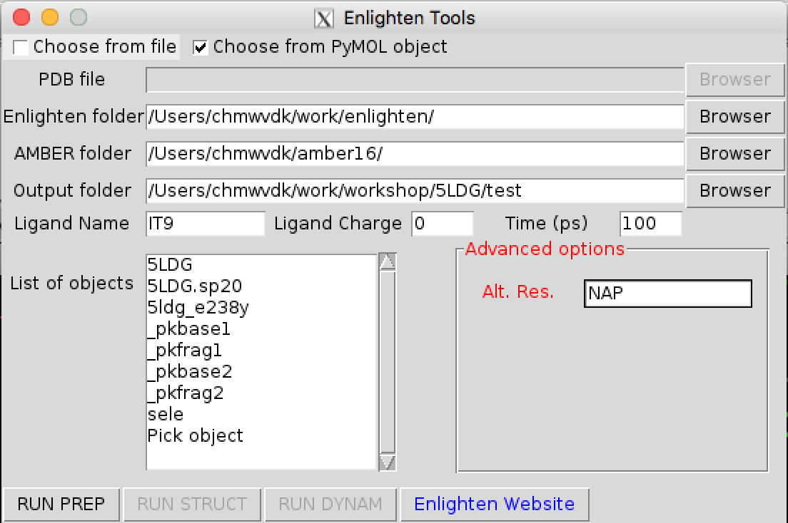

# Enlighten Tutorial 2: enzyme with co-factor
As an example of an enzyme system with (non-covalently bound) co-factor, we will use an NADP(H) containing reductase enzyme: isopiperitenone reductase. The starting point is PDB 5LDG, the structure of isopiperitenone reductase complexed with its substrate and NADP (see further [this paper](http://dx.doi.org/10.1002/ange.201603785)). We will need to supply parameters for the NADP co-factor.

**NB**: Whenever text is written in a `box like this`, it is a command that should be typed on a "command line", either in a "terminal" or in the PyMOL control panel.

## Preparation
*This preparation is only required if you haven't already done this previously on the computer you are working on, e.g. in another tutorial.*

### Step 1

---

We will first obtain the Enlighten plugin from the github repository. Open a terminal and type:
 
`git clone https://github.com/marcvanderkamp/enlighten.git`

Once the files have downloaded we need to set the ENLIGHTEN variable to indicate the location of the repository. 

`export ENLIGHTEN=/my/path/to/enlighten/`

where /my/path/to/enlighten/ will be something like "/Users/ext1234/enlighten"

**N.B.** If you already have cloned *Enlighten*, please make sure it is up-to-date by going into the directory:

`cd $ENLIGHTEN`

And update using a git 'pull':

`git pull`

-------

### Step 2
Open PyMOL. 
On typical Linux PCs (e.g. room MVB 2.11 in Bristol), this can be done by opening a "terminal" (click on top left icon on a Linux PC) and in this "terminal", type:

`pymol`

Two windows will appear: a viewing window and a control panel. 

We now need to load the enlighten plugin into PyMOL. From the Plugin drop-down menu choose Plugin and then Plugin Manager.

In the Plugin manager choose the Install New Plugin tab and then select install from local file. When you click on the "Choose file" button you will need to navigate to the enlighten directory and then choose the Pymol sub-folder. Click on the \_init_.py file and choose Open to install the plugin.

A new window will pop-up asking you to select a plugin directory. Choose the first option and click OK.

A message will appear to say that the plugin has been successfull installed. Exit the Plugin manager.

## Part 1: Preparing the model and co-factor parameters
We will use PyMOL to obtain the crystal structure we need directly from the protein databank. In the control panel type:

`fetch 5LDG`

A crystal structure will appear in the viewing window. You will also see an object called 5LDG appear in the right-hand viewing panel. There are buttons A,S,H etc. which contain drop down menus that allow you to make changes to how the object is viewed.
You can zoom in on the isopiperitenone substrate (which has residue name IT9), and then show the substrate and NADP(H) as 'sticks' with the following PyMOL commands:

`zoom resname IT9`
`show st, 5LDG and resname IT9+NAP`

You will notice that in this PDB, hydrogen atoms are already present. This means that in principle, we can start using *Enlighten* directly on this object. **But** we will need to define parameters for the NADP co-factor. To do this, we will need two additional files: 

- A 'topology' file that 'translates' atom names (from the PDB) into *atom types*, sets which 'partial charges' these atoms will have, and defines how they are bonded to each other. This file defines the molecule (co-factor), so that parameters can be assigned. For Amber/AmberTools, these files typically have the extensions **.prep**, **.prepc**, or **.off**
- A 'parameter' file with any parameters between the atom types in the co-factor that are not 'known' in the standard force field. For Amber/AmberTools, these files typically have the extension **.frcmod**

For several co-factors, parameters from the literature are gathered in the [AMBER parameter database](http://research.bmh.manchester.ac.uk/bryce/amber). Here, we will use the parameters contributed by Ulf Ryde (see [here](http://personalpages.manchester.ac.uk/staff/Richard.Bryce/amber/cof/nad_ryde_inf.html) for information, including references to papers to cite).

We can download the [nadp+.prep](http://personalpages.manchester.ac.uk/staff/Richard.Bryce/amber/cof/nadp+.prep) and [nad.frcmod](http://personalpages.manchester.ac.uk/staff/Richard.Bryce/amber/cof/nad.frcmod) files. 
Now, we need to make sure that:

1. The atom names in the .prep file directly correspond to the atom names for NAD in the PDB file 5LDG (and similarly for the residue name). As usual, this is not the case, and you will need to edit the .prep file *or* the .pdb file.
2. *Enlighten* will understand to use the .prep and .frcmod files for the residue NAP. Currently, this will be the case if the files are in the same directory where you run *Enlighten*, *and* filenames are the same as the three-letter residue name in the PDB, and the extensions are **.prepc** or **.off** for the 'topology' file and **.frcmod** for the parameter file (see above). 

Point **1** requires careful (manual) editing of the nadp+.prep file. Point **2** just requires you to rename the files to NAP.prepc and NAP.frcmod (because the NADP co-factor has the residue name NAP in 5LDG), and place them in the direcotory where you will run *Enlighten*.

To help you out, the correctly edited NAD.prepc file can be copied from the *Enlighten* files as follows (in the command-line terminal, *not* in PyMOL; you probably have to open a new terminal window for this, and go into the directory where you are going to run *Enlighten*):

`cp $ENLIGHTEN/tutorial2/NAP.prepc .`

And the NAD.frcmod file (which is the same as [nad.frcmod](http://personalpages.manchester.ac.uk/staff/Richard.Bryce/amber/cof/nad.frcmod)):

`cp $ENLIGHTEN/tutorial2/NAP.frcmod .`

For your information, the following gives an indication of the changes between **nadp+.prep** (left) and **NAP.prepc** (right):

Now, you are ready to run *Enlighten* on 5LDG.

**NB:** If you have previously run tutorial 1 and you typed `set pdb_use_ter_records, off` into the PyMOL control panel, you will need to change it back to the default:

`set pdb_use_ter_records, on`

## Part 2: Running the *Enlighten* protocols through the plugin 
Go to the Plugin drop-down menu and choose "enlighten".
We are now ready to use Enlighten to perform some simulations. 
From the plugin menu choose enlighten:

A (new) *Enlighten* control panel will appear. Some settings will be given as a default, but they can be changed if necessary. Click on the *choose from PyMol object* box and select 5LDG. You will need to change *Ligand Name* to IT9. Check that the other output settings are suitable (Note that *Ligand Charge* should be 0; you can enter "NAP" into the *Alt. Res.* box in the *Advanced options* section) and then click RUN PREP.

RUN PREP may take a couple of minutes to complete. Wait until you see the following printed in the PyMOL control panel:

*Finished PREP protocol.*

This means the protocol has finished successfully. If not, please note the message printed for more information.

When PREP has finished successfully, a new object "5LDG.sp20" will have been loaded into PyMOL. You will see that hydrogens have been added to the crystallographic water molecules and additional water molecules in a "solvent cap" of radius 20 Å have been added to the model.

We now need to let the model system 'relax' to remove any bad contacts present in the crystal structure. Click RUN STRUCT in the *Enlighten* control panel to perform the next stage of simulation.

The STRUCT protocol will take a few minutes to run. When it has finished succesfully, a new structure will be loaded into the "5LDG.sp20" object (as 'state 2'). Wait until you see the following printed in the PyMOL control panel:

*Finished STRUCT protocol.*

The RUN DYNAM button will now be active. Click RUN DYNAM to start the dynamics simulation.

This will take some time to run (estimated times will be printed in the PyMOL control panel), so we can now start to prepare a mutant model.

## Part 3: Creating a mutant and running *Enlighten*

We will now create a mutant structure to simulate for comparison. We will make the E238Y mutation, which was shown to switch the activity of the enzyme towards ketoreduction. See [the paper](http://dx.doi.org/10.1002/ange.201603785) for details.

We will start by copying our object 5LDG to the new object 5ldg\_e238y.

`create 5ldg_e238y, 5LDG`

We want to mutate Glu238 to Tyr, so we will zoom in on this residue.

`zoom 5ldg_e238y and res 238`

From the Wizard drop-down menu, select *Mutagenesis*.

Click on Glu238 and then choose Tyr from the *mutate to* menu in the right-hand panel. 

The lowest energy rotamer will then be displayed. 

Even though in this case, there is a significant clash with the substrate IT9, go ahead and click *apply* to accept the mutation and then *done* to exit the wizard.

From the plugin menu choose *enlighten* again.

A *new* enlighten control panel will appear. To run simulations on the mutant model you will need to select the new 5ldg\_e238y object from the list and then click RUN PREP. 

Once PREP is done, you will see the object 5ldg\e238y.sp20. Note that there will be 'bonds' shown between the clashing Tyr238 and the substrate. You can remove the 'bonds' visualisation of the non-physical bonds using:

`unbond resname IT9, res 234`

Follow the same procedure to RUN STRUCT and DYNAM for the mutant model. 

## Part 4: Analysis

The MD trajectory should be automatically loaded into the objects when DYNAM is finished. If you have been using PyMOL during the running of DYNAM, it is possible that the MD trajectory is not loaded. Also, you may want to reload the MD trajectory at a later date for viewing. 
The following commands can be used to load the results of the PREP, STRUCT and DYNAM protocols manually:

`load 5LDG/5LDG.sp20.pdb` 
`load 5LDG/struct/min_sa_5LDG.sp20.rst, 5LDG.sp20, 2, rst` 
`load 5LDG/dynam/md_5LDG.sp20.trj, 5LDG.sp20, 3, trj`  (DYNAM trajectory)
`load 5LDG/dynam/min_5LDG.sp20.rst, 5LDG.sp20, 103, rst`  (minimised final snapshot from DYNAM trajectory)
 

Press the play button to move between the frames. You can adjust the number of frames per second in the Movie drop-down menu. You can use the measurement function in the Wizard menu to monitor distances during the MD simulation. 

Zoom in on isopiperitenone (`zoom resname IT9`) and compare the position between wild-type (5LDG) and the E238Y mutant (5ldg_e238y). Also compare the position of the (mutated) residue, Glu238 or Tyr238 (both now renumbered as 234). You could now compare this to the proposed mechanisms in [Scheme 2](http://onlinelibrary.wiley.com/enhanced/figures/doi/10.1002/ange.201603785#figure-viewer-ange201603785-fig-5002) of [the paper](http://dx.doi.org/10.1002/ange.201603785), and see if the simulations can help you to explain the difference between wild-type IPR and IPR E238Y. 

(Note that we simulated NADP+, not NADPH, and simulations were performed with the isopiperitenone substrate only. You could further extend this study by using NADPH and re-running simulations with menthone instead of isopiperitenone.)

For some examples of the use of the analysis tools available as part of AmberTools, please see [Tutorial 1](../tutorial1/tutorial1.md), Part 4. 

-----------

__When you have come to the end of the tutorial and explored *Enlighten* in some detail, please fill out the *[feedback survey](https://goo.gl/forms/2KsHY7PGuqA9skV53)*.__

Results from the survey will influence future priorities for further development, so your views are important.

Bugs in the Enlighten plugin or scripts can be reported as an "Issue" through the [github site](https://github.com/marcvanderkamp/enlighten/issues).

If you have in-depth feedback or thoughts about Enlighten you would like to share, please [get in touch](mailto:marcvanderkamp@gmail.com).

### Thank you!

